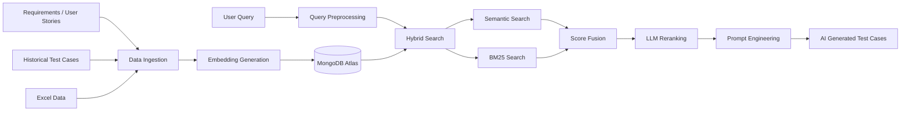

<div align="center">

# 🚀 AI Test Case Generation using Retrieval-Augmented Generation (RAG)

### Enterprise AI Platform for Intelligent Software Test Case Generation

[](https://nodejs.org/)
[](https://react.dev/)
[](https://www.mongodb.com/atlas)
[](https://en.wikipedia.org/wiki/Retrieval-augmented_generation)
[](https://groq.com/)
[](LICENSE)

> **Enterprise AI platform that transforms natural language business requirements into high-quality software test cases using Retrieval-Augmented Generation (RAG), Hybrid Search, Semantic Retrieval, and Large Language Models (LLMs).**

</div>

---

# 📌 Overview

Modern software organizations manage thousands of user stories, requirements, historical defects, and regression test cases. Finding relevant test cases and generating new ones manually is time-consuming, inconsistent, and difficult to scale.

This project demonstrates an enterprise AI-powered platform that combines **Retrieval-Augmented Generation (RAG)**, **Hybrid Search**, **Semantic Search**, **Prompt Engineering**, and **Large Language Models (LLMs)** to intelligently retrieve historical knowledge and generate high-quality software test cases.

Designed as a practical reference implementation for **AI Quality Engineering**, the platform demonstrates how retrieval pipelines, semantic search, and LLM orchestration can significantly improve software testing workflows.

---

# 🔗 Resources

| Resource | Link |
|----------|------|
| 💻 GitHub Repository | https://github.com/shaik-rahaman/ai-test-case-generation-rag |
| 🌐 Live Demo | Coming Soon |
| 👨‍💻 GitHub Profile | https://github.com/shaik-rahaman |
| 💼 LinkedIn | https://www.linkedin.com/in/shaikrahaman/ |

---

# 🎯 Why this Project?

Traditional QA teams struggle with:

- Manual test case creation
- Duplicate regression coverage
- Time-consuming test discovery
- Knowledge loss across releases
- Large repositories of historical test artifacts
- Limited semantic search capabilities

This project demonstrates how AI can significantly improve software quality engineering by combining retrieval systems with LLM reasoning.

---

# ✨ Core Features

| Capability | Description | Business Value |
|------------|-------------|----------------|
| Semantic Search | Retrieves relevant test cases using vector embeddings | Better recall than keyword search |
| Hybrid Search | Combines BM25 and semantic retrieval | Higher relevance and accuracy |
| Query Preprocessing | Expands abbreviations, synonyms, and domain terminology | Improves search quality |
| LLM Reranking | AI reranks retrieved results | More relevant context |
| Prompt Engineering | Structured prompts for consistent generation | Higher quality AI output |
| Data Ingestion | Imports Excel and user stories | Easy enterprise adoption |

---

# 🏗 Enterprise Architecture

The platform combines intelligent data ingestion, semantic retrieval, hybrid search, LLM orchestration, and prompt engineering into a unified AI-assisted software quality engineering workflow.



---

# 🤖 AI Pipeline

1. Data Ingestion
2. Data Conversion
3. Embedding Generation
4. MongoDB Atlas Storage
5. Query Preprocessing
6. Hybrid Retrieval
7. Score Fusion
8. LLM Reranking
9. Prompt Construction
10. AI Test Case Generation

---

# 🧠 Why Retrieval-Augmented Generation (RAG)?

Rather than relying only on an LLM's general knowledge, the platform retrieves relevant historical test cases, user stories, and engineering artifacts before generation.

This approach:

- Reduces hallucinations
- Improves traceability
- Produces context-aware test cases
- Increases consistency
- Grounds AI responses in enterprise knowledge

---

# 📈 Enterprise Use Cases

- AI-assisted QA Copilot
- Requirement-to-Test Case Generation
- Regression Planning
- Test Case Discovery
- Change Impact Analysis
- Test Repository Search
- Software Quality Engineering

---

# 📚 Technology Stack

| Layer | Technology |
|--------|------------|
| Frontend | React, Material UI |
| Backend | Node.js, Express |
| Database | MongoDB Atlas |
| Search | Vector Search, BM25, Hybrid Retrieval |
| AI | RAG, Mistral AI, Groq |
| Deployment | Oracle Cloud, PM2, Nginx |

---

# 🧠 AI Concepts Demonstrated

- Retrieval-Augmented Generation (RAG)
- Semantic Search
- Vector Embeddings
- Hybrid Retrieval
- BM25 Search
- Prompt Engineering
- LLM Orchestration
- Query Expansion
- Context Augmentation
- AI-assisted Software Quality Engineering

---

# 📷 Platform Showcase

## Dashboard

Coming Soon

---

## Query Processing

Coming Soon

---

## Hybrid Search

Coming Soon

---

## Generated Test Cases

Coming Soon

---

## Demo

Coming Soon

---

# 🚀 Quick Start

## Prerequisites

- Node.js 18+
- MongoDB Atlas
- Mistral API Key
- Groq API Key

## Installation

```bash
git clone https://github.com/shaik-rahaman/ai-test-case-generation-rag.git

cd ai-test-case-generation-rag

npm install
```

Create a `.env` file and configure:

```
MONGODB_URI=

MISTRAL_API_KEY=

GROQ_API_KEY=
```

Run:

```bash
npm run dev
```

---

# 📂 Project Structure

```text
client/
server/
src/
 ├── config/
 ├── data/
 ├── scripts/
 │   ├── data-conversion/
 │   ├── embeddings/
 │   ├── preprocessing/
 │   └── search/
```

---

# 🔮 Roadmap

- AI Agent Integration
- Multi-Agent Workflows
- DeepEval Integration
- Playwright Test Generation
- Selenium Test Generation
- JIRA Integration
- Enterprise Authentication
- CI/CD Integration

---

# 🚀 Related AI Projects

- 🤖 Autonomous QA Agent
- 🏥 VitalTriage
- 🌍 Orbit World Travels

---

# 👨‍💻 Author

## Shaik Khaleelur Rahaman

**AI Quality Engineering Leader**

Specializing in:

- Agentic AI
- Retrieval-Augmented Generation (RAG)
- LLM Evaluation
- Autonomous AI Systems
- AI-driven Software Quality Engineering

- GitHub: https://github.com/shaik-rahaman
- LinkedIn: https://www.linkedin.com/in/shaikrahaman/

---

⭐ If you found this project useful, please consider giving it a star.

Building enterprise AI systems with **Agentic AI**, **Retrieval-Augmented Generation (RAG)**, **Large Language Models**, and **AI-driven Quality Engineering**.